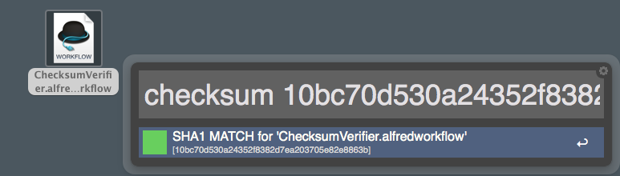

#alfred-checksum-veirfier

This Alfred 2 workflow check the checksum validity of a file with respect to sha1, md5 and sha256.

Thanks to [alfred.py](https://github.com/nikipore/alfred-python) for ease the communication with Alfred.

##Installation
Download and double-click [ChecksumVerifier.alfredworkflow](https://github.com/Arci/alfred-checksum-veirfier/raw/master/ChecksumVerifier.alfredworkflow).

##Usage

select in Finder the file to check then type `checksum <digest>` into alfred 




##Note

The script [luncher.scpt](https://github.com/Arci/alfred-checksum-veirfier/raw/master/luncher.scpt) is used in alfred to get the current selected file in Finder and then call the python script

===
To manually get the digest (for example sha1) of a file use:

```
openssl dgst -sha1 filename
```